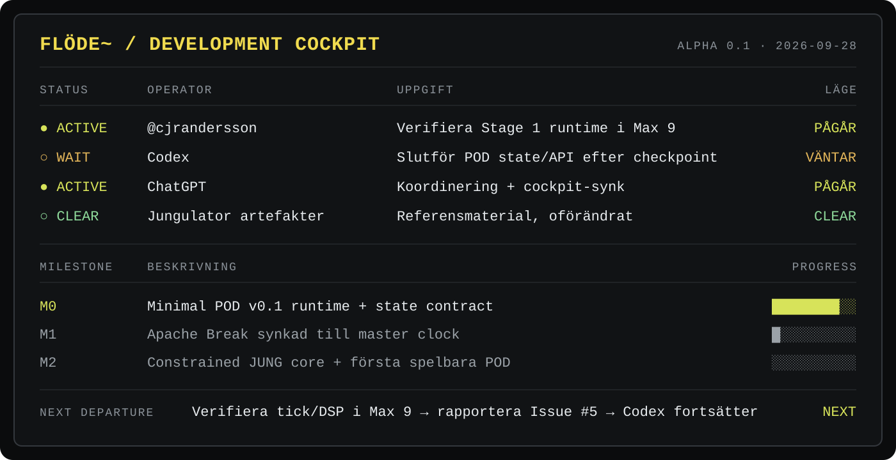

# flöde~ MVP

flöde~ is a six-pod sampler, generative sequencer, audio mangler and looper built around a shared master clock/BPM. The project evolves the character and workflow of the original I Am The Mighty Jungulator into a cleaner, more robust Max/MSP / Max for Live / standalone instrument.

---

# 🎛️ DEVELOPMENT COCKPIT

> **Operativ source of truth för projektets aktuella läge.** Den visuella tavlan ska hållas synkroniserad med Issue #5, aktuell branch-status, owners, milestones och nästa steg.

---

## Max/MSP quick access — `max-msp`

- **Open first — Max project:** [flode_alpha_01.maxproj](https://github.com/cjrandersson/flode-mvp/blob/max-msp/patches/flode_alpha_01/flode_alpha_01.maxproj)
- **Main patch:** [flode_alpha_01.maxpat](https://github.com/cjrandersson/flode-mvp/blob/max-msp/patches/flode_alpha_01/patchers/flode_alpha_01.maxpat)
- **Pod A patch:** [flode_pod_v01.maxpat](https://github.com/cjrandersson/flode-mvp/blob/max-msp/patches/flode_alpha_01/patchers/flode_pod_v01.maxpat)
- **All Max patchers:** [patches/flode_alpha_01/patchers/](https://github.com/cjrandersson/flode-mvp/tree/max-msp/patches/flode_alpha_01/patchers)
- **Test audio / media:** [patches/flode_alpha_01/media/](https://github.com/cjrandersson/flode-mvp/tree/max-msp/patches/flode_alpha_01/media)
  - [Apache Break ( Driven Silk Red ).wav](https://github.com/cjrandersson/flode-mvp/blob/max-msp/patches/flode_alpha_01/media/Apache%20Break%20(%20Driven%20Silk%20Red%20).wav)
  - [JAY_DEE_vol_01_kit_03_hihat.wav](https://github.com/cjrandersson/flode-mvp/blob/max-msp/patches/flode_alpha_01/media/JAY_DEE_vol_01_kit_03_hihat.wav)
  - [Om Unit - Ambient Breakbeat Sample Pack - 60 Kick Thump.wav](https://github.com/cjrandersson/flode-mvp/blob/max-msp/patches/flode_alpha_01/media/Om%20Unit%20-%20Ambient%20Breakbeat%20Sample%20Pack%20-%2060%20Kick%20Thump.wav)
- **Max 9 test evidence:** [docs/test-evidence/max9/stage1/](https://github.com/cjrandersson/flode-mvp/tree/max-msp/docs/test-evidence/max9/stage1)
  - [stage1-max9-podA-apache-buffer-loaded.png](https://github.com/cjrandersson/flode-mvp/blob/max-msp/docs/test-evidence/max9/stage1/stage1-max9-podA-apache-buffer-loaded.png)
- **Expanded quick-link index:** [MAX_MSP_QUICK_LINKS.md](https://github.com/cjrandersson/flode-mvp/blob/max-msp/MAX_MSP_QUICK_LINKS.md)

## Locked MVP direction
- Six independent sampler pods A–F in one window
- Large Simpler-inspired waveform/slice view per pod
- Drag/drop audio, loop start/end, speed, volume, pan
- Original Jungulator controls retained and made clearly visible
- RND: slice/sample-position probability amount
- RND2: velocity/playback-speed variation
- Random modes: Jung, Weighted, Walk, Memory, Chaos
- Transient slicing and density control
- Sync/free operation per pod; shared master clock and BPM
- Mute, Solo, Record, Panic and choke groups
- Per-pod FX and reorderable master FX chain
- Separate resizable flöde~ BPM/transport window

## UI baseline
The interface must feel like an audio instrument, not a web dashboard. Waveforms and primary gestures are large. Playback/random/volume use sliders. Rotary knobs are reserved mainly for pan and sound-shaping/FX. Matte charcoal/grey surfaces, restrained amber accents, neutral typography, minimal rounding, stable interaction states.

## Repository structure
- `docs/` build plan and UI specification, basic architecture of Max/MSP + javascript, peer-review of technical architecture by Copilot (see ARCHITECTURE_REVIEW.md)
- `patches/` Max/MSP builds
- `prototype/showcase-v4/` current p5.js visual prototype
- `design/figma-export/` current Figma AI export reference

## Current build status
The original Pod A build pass established the core Max engine: `dropfile → buffer~ → waveform~ → groove~ → volume/pan → stereo out`. The active Alpha 0.1 work remains constrained to `max-msp` and Issue #5.