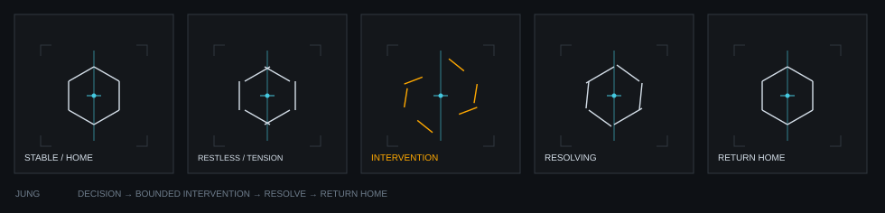

# JUNG behavioral glyph

**Status:** Provisional visual concept, pending CJ review and actual reference-picture analysis.



## Meaning

The cyan vertical line, crossbar and central point are the fixed temporal anchor. A six-edge inner geometry depicts a phrase held around that anchor. Construction brackets reserve its space in the UI. The geometry changes to communicate musical tension; it does not display weights, RNG seeds or individual event probabilities.

A single high-level temperament control may request restrained ↔ restless character. JUNG owns the correlation and translation into internal behavior. The glyph is read-only musical feedback, separate from the control.

## States

| State | Geometry | Semantic signal |
| --- | --- | --- |
| STABLE / HOME | Closed canonical six-edge geometry | Phrase is at its stable reference |
| RESTLESS / TENSION | Small alternating edge displacement | Tension is increasing while the anchor remains fixed |
| INTERVENTION | Six bounded, shortened fragments; restrained orange | One intervention is in progress |
| RESOLVING | Fragments converge toward the canonical edges | The phrase is returning |
| RETURN HOME | Exactly the STABLE/HOME coordinates | The bounded intervention has completed |

Invariant: **decision → bounded intervention → resolve → return home**.

The maximum study fragment displacement is approximately 15 units in a radius-32 geometry. The anchor does not translate, rotate, fade out or fragment. HOME and RETURN HOME reuse identical segment coordinates. A glyph can look close to breaking apart without losing the temporal reference.

## Controller interface proposal

```text
set behavior_state home|restless|intervention|resolving|return_home
set visual_phase <0..1>
set tension <0..1>
set anchor_position <0..1>
set event_version <monotonic integer>
```

These are visual semantics to review, not an implemented JUNG engine API. They do not alter `JUNG_BRAIN_ARCHITECTURE.md` or an audio/event contract. The displayed anchor may track an authoritative phrase position; the local glyph coordinate system still remains fixed.

A stale event version cannot restart or extend a motion. HOME overrides pending animation immediately. A controller discontinuity/reset displays canonical home. An intervention cannot recursively generate another visual intervention.

## Geometry and interaction

The study uses a 176-square field. An embedded glyph should normally occupy 64–96 units and sit beside a short state label in a fixed-width area below the waveform, secondary to audio selection. Text shows the state even when motion is disabled. Do not turn each fragment into a probability handle.

No drag behavior is assigned to this glyph. An optional click could open a behavior inspector later if approved; the inspector must describe musical context rather than expose an internal probability graph.

## Implementation notes

SVG contains only paths, lines, circles, rectangles and text. Store six canonical edge pairs, plus bounded variant coordinates. Max mgraphics can stroke those pairs directly. Canvas/p5.js can use the same normalized pairs. Interpolation needs a shared edge count and no random geometry generation.

The current five-state SVG is static. The standalone Max 9 prototype does not bind it to JUNG or animate it. Review metaphor, scale, legibility, state labels, bounded separation and return before a behavioral connection is considered.
