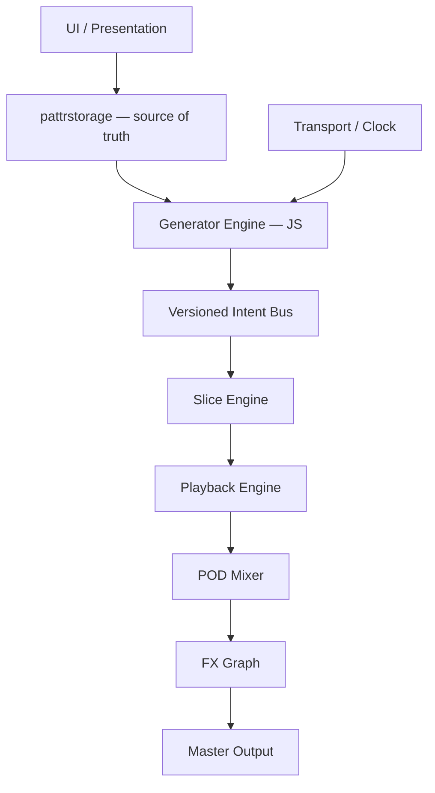

# FLÖDE~ — Technical Architecture Review for Codex

> Teknisk arkitekturgranskning och implementationsunderlag för Max/MSP + JavaScript for Max.

## Dokumentstatus

| Fält | Värde |
| --- | --- |
| Projekt | FLÖDE~ |
| Dokumenttyp | Architecture review / implementation guidance |
| Primär målmiljö | Max/MSP och Max for Live |
| Scripting-runtime | JavaScript for Max (`js`), inte Java/`mxj` |
| Granskningsgrund | Beskriven arkitektur och uppgiven implementationstatus |
| Runtime-verifiering | Inte genomförd i detta dokument |

> [!IMPORTANT]
> Dokumentet skiljer mellan **dokumenterad nulägesbild**, **målarkitektur** och **overifierade antaganden**. Codex får inte tolka en beskriven målarkitektur som redan implementerad. Kontrollera alltid aktuell patch, abstractions och JavaScript-filer innan kod ändras.

## Syfte och scope

Granskningen fokuserar på:

- Max/MSP-arkitektur
- JavaScript for Max
- eventmodell och scheduler-beteende
- state-hantering och preset recall
- skalbarhet till sex POD-instanser
- runtime- och DSP-risker
- generativ motor-design
- Max for Live-kompatibilitet

Utanför scope: full ljudkvalitetsbedömning, komplett UI-designgranskning, benchmarking på målmaskiner och verifiering i Ableton Live.

## Källspårning

Originalunderlaget refererar till en PDF med det förkortade namnet `FLODE_GRUN...P_JAVA.pdf`. När källfilen läggs i repositoryt ska detta ersättas med en exakt repo-relativ länk, exempelvis:

```md
[Grundarkitektur](./docs/<exact-source-filename>.pdf)
```

Påståenden som kommer från underlaget är därför **dokumenterade men inte runtime-verifierade** tills motsvarande Max-patchar och JavaScript-filer har inspekterats eller testats.

---

## Executive summary

FLÖDE~ har en ovanligt mogen målarkitektur för ett Max-system. De största styrkorna är tydlig lagerindelning, device-scopade namn, återanvändbara POD-abstraktioner och separation mellan eventgenerering, state och DSP.

Den största svagheten är gapet mellan den beskrivna designen och den verifierade runtime-implementationen. Flera centrala delar — framför allt Intent API, MEMORY, CHAOS, slice-engine och kopplingen av `position`/`velocity` till playback — är fortfarande semantiskt beskrivna snarare än algoritmiskt specificerade och testade.

### Bedömning

| Område | Bedömning | Kommentar |
| --- | ---: | --- |
| Arkitektur | 8.5/10 | Stark separation och god instansisolering |
| Runtime-mognad | 5–6/10 | Uppskattning; måste verifieras i patch och Live |
| Potential | 9.5/10+ | Förutsätter full implementation och validering |

---

## Statusmodell för Codex

Använd följande etiketter i issues, kodkommentarer och framtida arkitekturdokument:

| Status | Betydelse |
| --- | --- |
| `IMPLEMENTED` | Finns i aktuell kod/patch och har inspekterats |
| `VERIFIED` | Har dessutom testats i relevant runtime |
| `PARTIAL` | Finns delvis, men hela signal- eller statekedjan är inte kopplad |
| `TARGET` | Önskad målarkitektur, ännu inte bekräftad som implementerad |
| `UNVERIFIED` | Påståendet kommer från dokumentation men är inte kontrollerat |
| `DECISION_REQUIRED` | Kräver ett explicit tekniskt beslut innan implementation |

Codex ska uppdatera status först efter evidens från patch, JavaScript-kod eller reproducerbart test.

---

## Övergripande arkitektur

Den dokumenterade arkitekturen delar systemet i fem oberoende lager:

1. Presentation
2. State
3. Event
4. DSP
5. Routing

Detta är designens starkaste beslut. Separationen minskar komplexiteten i bland annat:

- preset recall
- duplicering av Max for Live-enheter
- DSP-återinitiering
- routing-kollisioner
- isolerad testning av generativa algoritmer

### Rekommenderad målarkitektur (v2)



### Arkitekturell regel

UI ska uttrycka användarens kontrollvärden. Generatorn ska uttrycka playback-intentioner. DSP ska verkställa intentionerna. Inget lager ska i onödan äga eller duplicera state från ett annat lager.

---

## Design architecture kontra runtime architecture

Underlaget använder formuleringar som:

- `inte färdigkopplat`
- `future intent`
- `runtime unverified`
- `målarkitektur`

Det innebär att designen ligger före implementationen.

### Konsekvens

Innan ny funktionalitet byggs ska Codex kartlägga den faktiska runtimekedjan:

```text
UI control
  -> state owner
  -> event source
  -> message/bus
  -> DSP consumer
  -> audible result
```

För varje kontroll eller generator-output ska följande besvaras:

1. Var skapas värdet?
2. Var lagras det?
3. Hur transporteras det?
4. Vem konsumerar det?
5. Vad händer vid load, preset recall och device duplication?
6. Kan beteendet reproduceras med ett fast seed?

---

## Terminologi: Java kontra JavaScript

### Problem

Titeln i originalunderlaget använder `Max/MSP & Java`, medan den aktuella generatorn enligt samma underlag använder JavaScript for Max via `js`. Java/`mxj`, JVM-klasser och Java SDK används inte i den beskrivna arkitekturen.

För en extern utvecklare signalerar ordet **Java** fel teknikstack.

### Beslut

Använd genomgående någon av följande benämningar:

- **Max/MSP + JavaScript for Max** — rekommenderad och mest exakt
- **Max/MSP + JS Runtime** — kortform när sammanhanget redan är tydligt

Använd endast **Java** om projektet faktiskt introducerar `mxj` eller JVM-baserade komponenter.

### Acceptanskriterier

- README, docs och kodkommentarer använder korrekt terminologi.
- Filnamn eller rubriker som felaktigt nämner Java uppdateras.
- Ingen funktionell kod ändras enbart för terminologijustering.

---

## Generative Engine

### Dokumenterad modell

```text
Clock
  -> Generator
  -> Intent
  -> DSP
```

Riktningen är korrekt, men gränsen mellan generator och DSP behöver ett formellt kontrakt.

## Intent API

### Problem

Generatorn uppges lämna `speed`, `position` och `velocity`, men det finns inget dokumenterat, versionsbart kontrakt för payload, timing, enheter, defaults eller felhantering.

Utan kontrakt blir det svårt att:

- logga och felsöka beslut
- spela upp samma generativa sekvens igen
- migrera mellan generatorversioner
- testa generatorn utan DSP
- avgöra vilka fält playback-motorn faktiskt stödjer

### Rekommenderat kanoniskt event

```js
{
  apiVersion: 1,
  eventId: 1842,
  podId: "A",
  timestampMs: 12480,
  transportBeat: 32.5,
  mode: "jung",
  positionNorm: 0.42,
  velocityNorm: 0.78,
  sliceIndex: 6,
  rate: 1.0,
  probability: 0.85,
  durationMs: 180,
  seed: 91723
}
```

### Fältkontrakt

| Fält | Typ | Enhet/intervall | Krav |
| --- | --- | --- | --- |
| `apiVersion` | integer | `>= 1` | Obligatoriskt |
| `eventId` | integer/string | Unikt per device-session | Obligatoriskt |
| `podId` | string | `A`–`F` | Obligatoriskt |
| `timestampMs` | number | Millisekunder från definierad epoch/sessionstart | Obligatoriskt |
| `transportBeat` | number | Ableton/Max transport beats | Rekommenderat vid sync |
| `mode` | string | `random`, `jung`, `memory`, `chaos` | Obligatoriskt |
| `positionNorm` | number | `0.0–1.0` | Clampas innan DSP |
| `velocityNorm` | number | `0.0–1.0` | Clampas innan gain mapping |
| `sliceIndex` | integer/null | Giltigt slice-index | Valfritt |
| `rate` | number | Playback ratio; negativt tillåtet om reverse stöds | Obligatoriskt |
| `probability` | number | `0.0–1.0` | Obligatoriskt |
| `durationMs` | number | `> 0` | Valfritt beroende på playback mode |
| `seed` | integer | Reproducerbart RNG-seed | Rekommenderat |

> [!NOTE]
> Objektet ovan är det kanoniska logiska formatet. JavaScript for Max-transporten kan implementeras med exempelvis `Dict` eller en dokumenterad ordnad list-message. Transportformatet måste väljas explicit och får inte lämnas implicit i outlet-ordningen.

### Valideringsregler

- Clamp eller avvisa normaliserade värden utanför `0.0–1.0`.
- Avvisa okänd `apiVersion` med tydlig loggning.
- Definiera fallback när ett `sliceIndex` inte längre finns.
- Skicka aldrig `NaN`, `Infinity` eller negativa durationsvärden till DSP.
- Separera eventets skapandetid från dess kvantiserade exekveringstid.
- Alla stochastic modes ska kunna köras deterministiskt med seed i testläge.

### Acceptanskriterier

- Samma event kan loggas, valideras och spelas upp igen.
- Generatorn kan testas utan aktiv ljudmotor.
- Playback Engine kan testas med syntetiska intents utan aktiv generator.
- Alla PODs använder samma API-version.

---

## Runtime-gap: endast `speed` används

Underlaget uppger att `flode_gen.js` redan producerar `speed`, `position` och `velocity`, men att endast `speed` används i nuvarande runtime.

### Uppgiven nulägeskedja (`PARTIAL` / `UNVERIFIED`)

```text
Generator -> speed -> groove~
```

### Önskad kedja (`TARGET`)

```text
Generator
  -> position
  -> velocity
  -> rate/speed
  -> slice
  -> duration
  -> Playback Engine
```

### Rekommenderad ordning

1. Verifiera att fälten faktiskt lämnar `flode_gen.js`.
2. Logga payloaden utan att påverka DSP.
3. Koppla `position` med smoothing och bounds checking.
4. Koppla `velocity` via en dokumenterad gainkurva.
5. Introducera `sliceIndex` först efter att slice-datamodellen är stabil.
6. Lägg till `duration` när note-off/voice-lifetime är definierad.

### Acceptanskriterier

- Varje fält har en tydlig DSP-konsument.
- Bypass av ett fält lämnar befintlig playback oförändrad.
- Ingen parameterändring skapar klick, ogiltig bufferposition eller runaway gain.

---

## JUNG mode

### Problem

JUNG beskrivs genom upplevt beteende — repetitioner, pauser, större hopp och sällsynta extremvärden — men inte genom en algoritm. Det räcker som kreativ riktning, men inte som implementation specification.

### Rekommenderad första state machine

```js
const JUNG_TRANSITIONS = {
  repeat: 0.35,
  newEvent: 0.35,
  pause: 0.15,
  jump: 0.10,
  extreme: 0.05
};
```

Summan ska alltid vara `1.0`. Värdena är startvärden och ska kunna justeras efter lyssningstest.

### Tillståndens ansvar

| Tillstånd | Beteende |
| --- | --- |
| `repeat` | Återanvänd föregående event eller fras med begränsad variation |
| `newEvent` | Generera ett nytt event inom aktuellt kontrollområde |
| `pause` | Skapa en explicit tyst händelse, inte ett saknat scheduler-event |
| `jump` | Välj ett avlägset giltigt område/slice |
| `extreme` | Tillåt sällsynt randvärde inom hårda säkerhetsgränser |

### Krav

- Alla beslut ska kunna loggas med state, vikt, random draw och seed.
- Pauser ska vara förstaklass-events så att timing går att reproducera.
- UI-parametern för JUNG amount ska mappa till dokumenterade förändringar i transition weights eller variationsdjup.
- Säkerhetsgränser ska ligga utanför den kreativa slumpmodellen.

---

## MEMORY mode

### Problem

MEMORY är den mest intressanta men minst specificerade funktionen. Begrepp som `memory depth`, `memory curve` och `self-created phrases` saknar ännu definierad datastruktur, retrievalmodell, viktning och decayfunktion.

### Rekommenderad tredelad design

#### Layer 1 — event memory

```js
memoryEvents = [
  {
    intent,
    createdAtBeat,
    lastUsedAtBeat,
    useCount,
    importance
  }
];
```

Använd en bounded ring buffer eller annan explicit maxstorlek för att undvika obegränsad tillväxt.

#### Layer 2 — weighted retrieval

En möjlig startmodell:

```text
ageDecay = exp(-lambda * ageInBeats)
noveltyPenalty = 1 / (1 + useCount)
weight = ageDecay * importance * noveltyPenalty
```

Alla termer och intervall ska dokumenteras. `lambda` kan härledas från användarens memory curve, men mappningen måste vara stabil och testbar.

#### Layer 3 — phrase clusters

```js
phrase = {
  id,
  events: [],
  lengthBeats,
  createdAtBeat,
  useCount,
  importance
};
```

Återhämtning av fraser, inte bara enskilda events, är det som kan ge MEMORY ett igenkännbart musikaliskt beteende.

### Beslut som måste fattas

- Lagrar MEMORY råa intents, exekverade events eller båda?
- Är minnet per POD eller globalt?
- Ska minnet överleva preset recall, device reload eller projektöppning?
- Hur definieras phrase boundaries?
- Hur påverkar användarens manuella handlingar `importance`?
- När och hur rensas minnet?

### Acceptanskriterier

- Minnesanvändningen är begränsad och mätbar.
- Samma seed och inputhistorik ger samma retrievalsekvens i testläge.
- Memory depth och curve har dokumenterad musikalisk och matematisk effekt.
- Reset och preset recall ger definierat beteende.

---

## CHAOS mode

### Problem

Definitionen `deterministisk nonlinear feedback` är inte tillräcklig för implementation. Exakt dynamiskt system, parameterintervall, initialvärden och mapping till musikaliska parametrar måste definieras.

### Kandidater

#### Logistic map

```js
x = r * x * (1 - x);
```

Fördel: enkel, billig och lätt att testa. Nackdel: kan fastna eller bli mindre musikaliskt varierad beroende på `r` och seed.

#### Hénon map

```text
x[n+1] = 1 - a * x[n]^2 + y[n]
y[n+1] = b * x[n]
```

Fördel: tvådimensionell output kan mappas till exempelvis position och rate. Nackdel: kräver noggrann bounds mapping.

#### Lorenz-inspirerad attractor

Kan skapa rikare korrelerade rörelser, men har högre implementations- och tuningkostnad och bör inte vara första MVP-valet.

### Rekommendation för MVP

Starta med **logistic map** bakom ett gemensamt CHAOS-interface. Håll algoritmen utbytbar så att Hénon kan A/B-testas senare.

### Säkerhetskrav

- Clamp sker efter algoritmen men före Intent API/DSP.
- Interna värden återställs säkert vid `NaN`, `Infinity` eller instabilitet.
- Algoritm, parametrar, seed och initial state loggas i debugläge.
- Samma initial state ska ge samma eventsekvens.

---

## State management

### Styrka

Användningen av `autopattr`, `pattr` och `pattrstorage` är rätt grund för presets och Max for Live-state.

### Risk

Underlaget antyder att state även kan finnas i:

- JavaScript
- `zl reg`
- `gate`

Det skapar risk för:

- preset mismatch
- restore mismatch
- automation mismatch
- skillnad mellan UI-värde och faktisk DSP-state

### Princip: single source of truth

```text
pattrstorage = persistent authoritative state
```

JavaScript får ha transient runtime-state — exempelvis RNG-state, pågående fras och scheduler bookkeeping — men persistent användarstate ska serialiseras via en dokumenterad ägare.

### Stateklassificering

| State-typ | Exempel | Ägare | Ska sparas? |
| --- | --- | --- | --- |
| User state | mode, amount, rate, sliceval | `pattrstorage` | Ja |
| Derived state | normaliserad gain, beräknade bounds | Beräknas från user state | Nej |
| Runtime state | aktiv voice, pending event | Playback/event engine | Normalt nej |
| Generative history | MEMORY events/phrases | Explicit memory store | Beslut krävs |
| Debug state | logs, counters | Debug subsystem | Nej |

### Restoreordning

1. Ladda persistent state.
2. Validera och clampa värden.
3. Initiera buffer- och slice-metadata.
4. Initiera generator med mode, seed och relevanta parametrar.
5. Starta scheduler/transportkoppling.
6. Aktivera DSP-konsumtion.

### Acceptanskriterier

- UI, generator och DSP visar samma värde efter preset recall.
- Ingen stale JS-state överlever när den borde återställas.
- Device reload och duplication ger definierat, isolerat state.
- Automation skriver till samma auktoritativa parameter som presets använder.

---

## Slice-system

### Nuvarande beslutsgap

Underlaget nämner både `bonk~` och FluCoMa som analysalternativ. Det betyder att kärnans analysmotor ännu inte är låst.

### Rekommendation

| Fas | Slice-strategi | Motiv |
| --- | --- | --- |
| MVP | Manuella slices | Minst beroenden, snabbast att stabilisera playback och state |
| Release | FluCoMa | Modernare analysflöde och bättre grund för utbyggnad |

Undvik att underhålla två automatiska analysmotorer om det inte finns ett tydligt användarkrav.

### Gemensam slice-datamodell

```js
{
  apiVersion: 1,
  bufferId: "#1.pod.A.buffer",
  analysisRevision: 3,
  slices: [
    { index: 0, startMs: 0, endMs: 184, confidence: 1.0 }
  ]
}
```

Playback och generator ska konsumera samma slice-modell oavsett om slices skapats manuellt eller genom analys.

### Acceptanskriterier

- Slice-index är stabila inom en given `analysisRevision`.
- Byte av ljudfil invalidiserar eller migrerar gamla slices explicit.
- Ogiltiga eller tomma slices kan inte krascha playback.
- Slice-data är isolerad per device och POD.

---

## Max for Live och instansisolering

### Styrka

Underlaget visar förståelse för riskerna med duplicate track, flera samtidiga devices och globala namn. Device-scopade namn är rätt lösning.

Exempel:

```text
#1.pod.A.buffer
#1.flode.step
```

### Regler

- Alla `send`/`receive`, buffers, tables, dicts och coll-lager ska granskas för global name collision.
- Alla POD-abstraktioner ska få device-scope som argument.
- Undvik odokumenterade globala transportsignaler.
- Skilj device-identitet från POD-identitet.
- Duplicerade devices får inte dela buffer, slice-state, RNG-state eller MEMORY-historik av misstag.

### Verifieringsmatris

| Scenario | Förväntat resultat |
| --- | --- |
| Duplicera device på samma track | Fullt isolerad state och audio |
| Duplicera hela tracken | Ingen routing- eller bufferkollision |
| Sex aktiva PODs | Stabil scheduler och DSP |
| Två devices × sex PODs | Ingen cross-talk eller namnkonflikt |
| Save/reopen Live Set | Samma persistent state och definierad memory-state |
| Hot-swap preset | Ingen stale event queue eller ljudspik |

---

## DSP- och runtime-risker

### Lägre risk

Den grundläggande playbackkedjan bygger på väletablerade Max-objekt:

- `buffer~`
- `groove~`
- `line~`
- `*~`

### Högre risk

Separering av pitch och speed genom `stretch~` eller timestretch-funktionalitet i `groove~` kan bli systemets största CPU-risk, särskilt med sex samtidiga PODs och flera voices per POD.

### Riskmatris

| Risk | Sannolikhet | Påverkan | Rekommenderad mitigering |
| --- | --- | --- | --- |
| CPU-spik vid timestretch | Hög | Hög | Benchmarka 1, 6 och 12 voices; quality modes |
| Scheduler-jitter | Medel | Hög | Separera clock, intent creation och exekvering |
| Klick vid positionshopp | Hög | Medel/Hög | Ramps, crossfade eller voice switching |
| State mismatch vid recall | Medel | Hög | En state-ägare och deterministisk restoreordning |
| Namnkollision i M4L | Medel | Hög | `#1`-scope och duplicationstest |
| Obegränsad MEMORY-tillväxt | Medel | Medel/Hög | Bounded buffer och mätbara limits |
| Eventstorm från generator | Medel | Hög | Rate limit, queue limit och backpressure-policy |
| Ogiltig slice efter bufferbyte | Hög | Medel | Revisionering och explicit invalidation |

### Minimikrav för profiling

- Testa med sex PODs aktiva samtidigt.
- Testa lägsta och högsta avsedda BPM.
- Testa extrema men giltiga rate-, slice- och jittervärden.
- Mät CPU med timestretch av/på och per quality mode.
- Logga dropped, late och coalesced events.
- Testa minst en längre session för memory growth och scheduler drift.

---

## Eventmodell och scheduler

Eventlagret behöver ett explicit svar på när ett beslut skapas och när det utförs.

### Rekommenderad separation

```text
Transport tick
  -> Quantization boundary calculation
  -> Intent generation
  -> Validation
  -> Scheduled execution
  -> DSP acknowledgement / metrics
```

### Krav

- Definiera om tid uttrycks i millisekunder, samples, ticks eller transport beats i varje gränssnitt.
- Undvik att blanda Max high-priority scheduler med tunga JS-beräkningar.
- Definiera policy för sena events: drop, execute immediately eller reschedule.
- Definiera maximal kölängd och vad som händer vid eventstorm.
- Rensa pending events vid stop, device disable, preset switch och buffer unload.
- Samla metrics utan att blockera audio thread.

---

## Rekommenderad observability

Generativa system blir betydligt enklare att felsöka om beslut kan inspekteras utan att UI eller ljudkedjan påverkas.

### Debug event

```js
{
  level: "debug",
  subsystem: "generator.jung",
  podId: "C",
  eventId: 1842,
  decision: "jump",
  randomDraw: 0.812,
  seed: 91723,
  scheduledBeat: 32.5,
  executedLateMs: 1.7
}
```

### Krav

- Debugläge ska kunna stängas av helt i release.
- Loggning får inte ske på audio thread.
- Event-ID ska följa ett intent genom generator, bus och playback.
- Counters för dropped/late/invalid events ska kunna läsas vid test.

---

## Prioriterad implementation roadmap

### P0 — verifiera och stabilisera grunden

- [ ] Inventera faktiska patchar, abstractions och JavaScript-filer.
- [ ] Märk varje större subsystem med statusmodellen i detta dokument.
- [ ] Byt felaktig terminologi från Java till JavaScript for Max.
- [ ] Kartlägg state ownership och ta bort oavsiktliga dubbla sanningskällor.
- [ ] Verifiera device-scope för samtliga namngivna Max-resurser.

### P1 — definiera kontrakt

- [ ] Implementera och versionera Intent API.
- [ ] Välj och dokumentera transportformat mellan JS och Max-patch.
- [ ] Lägg till validering, seed och event-ID.
- [ ] Skapa en debug/loggväg som kan stängas av.
- [ ] Skriv kontraktstester för generator och playback.

### P2 — stäng runtime-gapet

- [ ] Koppla `position` till playback med säker smoothing.
- [ ] Koppla `velocity` via dokumenterad gain mapping.
- [ ] Definiera och koppla `sliceIndex`.
- [ ] Definiera `duration` och voice-lifetime.
- [ ] Verifiera att alla intents ger hörbar och reproducerbar effekt.

### P3 — stabilisera slices och generativa modes

- [ ] Färdigställ manuell slice-engine för MVP.
- [ ] Implementera JUNG som explicit state machine.
- [ ] Specificera och implementera MEMORY-datastruktur, decay och phrase retrieval.
- [ ] Implementera CHAOS bakom gemensamt interface, initialt med logistic map.
- [ ] Vänta med ytterligare generatorfunktioner tills slice- och playbackkedjan är stabil.

### P4 — M4L- och prestandavalidering

- [ ] Kör duplication-, recall- och reopen-matrisen.
- [ ] Profilera sex PODs och relevanta voice counts.
- [ ] Benchmarka timestretch quality modes.
- [ ] Testa scheduler-jitter, eventstorm och längre sessioner.
- [ ] Dokumentera verifierad CPU-budget och kända begränsningar.

---

## Definition of Done för arkitektur v2

Arkitektur v2 är inte klar förrän:

- ett versionsbart Intent API används av alla PODs
- persistent state har en dokumenterad single source of truth
- `position`, `velocity`, `rate`, `slice` och `duration` har definierade konsumenter eller uttryckligen märkts som senare scope
- JUNG, MEMORY och CHAOS är algoritmiskt specificerade
- slice-modellen är gemensam för manuella och framtida analyserade slices
- två samtidiga FLÖDE~-devices fungerar utan cross-talk
- preset recall, Live Set reopen och device duplication är testade
- CPU och scheduler-beteende är profilerat med sex PODs
- målarkitektur och verifierad runtime-status är dokumenterade separat

---

## Instruktioner till Codex

När detta dokument används som arbetsunderlag ska Codex:

1. Inspektera repositoryt innan implementation och inte anta att underlagets målarkitektur redan finns.
2. Bevara fungerande DSP och användarbeteende genom små, verifierbara ändringar.
3. Inte introducera Java/`mxj`; nuvarande avsedda scripting-runtime är JavaScript for Max.
4. Prioritera kontrakt, state ownership, slice-engine och runtimekoppling före nya features.
5. Använda device-scopade namn i alla nya Max-resurser.
6. Lägga säkerhetsvalidering mellan generativ output och DSP.
7. Göra stochastic behavior reproducerbart med seed i testläge.
8. Dokumentera evidens för varje statusändring från `TARGET`/`UNVERIFIED` till `IMPLEMENTED`/`VERIFIED`.
9. Rapportera blockerande beslut som `DECISION_REQUIRED` i stället för att gissa.
10. Köra relevanta Max/M4L-tester efter varje förändring som påverkar state, routing, scheduler eller DSP.

### Förväntad Codex-rapport efter en implementation

```md
## Change summary
- Vad som ändrades
- Varför det ändrades

## Files changed
- Patchar, abstractions och scripts

## Architecture status
- IMPLEMENTED:
- VERIFIED:
- PARTIAL:
- DECISION_REQUIRED:

## Validation
- Utförda tester
- Resultat
- Ej körbara tester och varför

## Risks / follow-up
- Kvarvarande risker
- Nästa minsta säkra steg
```

---

## Slutomdöme

Ur ett utvecklarperspektiv är den största styrkan att FLÖDE~ redan är tänkt i subsystem, kontrakt, instansisolering, state management och separation mellan event och DSP.

Den största svagheten är att flera centrala generativa komponenter fortfarande är beskrivna semantiskt snarare än algoritmiskt, samtidigt som delar av runtimekedjan är ofullständigt kopplade eller overifierade.

Den viktigaste nästa fasen är därför inte fler generativa features, utan att göra arkitekturen **mätbar, versionsbar, reproducerbar och verifierad i faktisk Max for Live-runtime**.
