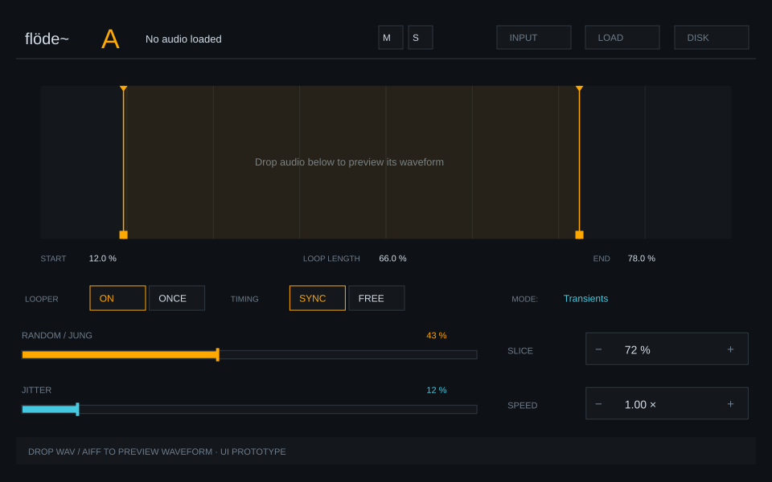

# flöde~ Pod A — Max 9 UI prototype

A standalone `v8ui` preview of the approved [Pod A UI contract](../../design/POD_A_UI-R&D.md). Seven reusable component instances share one renderer; the demo controller supplies authoritative state and engineering-unit display strings.



## Open in Max 9

1. Download the [max-msp branch ZIP](https://github.com/cjrandersson/flode-mvp/archive/refs/heads/max-msp.zip) and extract it.
2. Open `prototype/max9-pod-a/flode_pod_a_ui.maxproj`.
3. Open `flode_pod_a_ui.maxpat`. It opens in Presentation.
4. Drop a WAV or AIFF on the bottom strip. The controller builds a cached min/max waveform from the loaded audio.
5. Drag the loop handles, loop body, Jung/Jitter sliders or stepper value fields. Click stepper −/+ to adjust. Shift gives fine slider/stepper movement and bypasses loop snapping.
6. Open the Max Console to inspect semantic events. Double-click the waveform to request a full-loop reset.

The Apache reference sample is in `patches/flode_alpha_01/media/`. This is a UI preview: dropping audio draws its waveform; there is no connected audio output, transport or generative engine.

The INPUT, LOAD and DISK header placeholders are dim and disabled. M/S and mode selections are confirmed by the demo controller. A–F component identity is reusable; this harness demonstrates A.

## p5.js preview

The [p5.js companion](../p5-pod-a/) runs this same component renderer and demo controller through a small host adapter. Geometry, gestures and display mapping are shared. Its README has local browser instructions and ten cross-host integration checks; browser/Max runtime verification is pending.

## Pictures and graphics

The [component atlas](../../design/ui/component-atlas/README.md) adds six SVG studies, design tokens, motion notes and a JUNG behavior glyph proposal under CJ's new R&D brief.

[Open the graphics catalog](graphics/README.md) for the original repository picture references, the full-panel SVG and individual header, waveform, slider, stepper, mode-button, loop-handle and M/S assets.

The SVGs are editable vector snapshots of this implementation. The live Max controls are painted with `mgraphics`; the SVGs serve as visual references and individual assets rather than static images placed over interactive controls.

The current repository connection could read SVG/code but could not retrieve binary PNG or linked attachment images for visual inspection. This pass follows the written Pod A contract and existing source geometry. A pixel-for-pixel match to the original pictures still needs visual review.

## Reuse a component

Instantiate the shared script with standard object arguments:

```text
v8ui flode_ui_component.js @arguments A header
v8ui flode_ui_component.js @arguments A waveform
v8ui flode_ui_component.js @arguments A jung
v8ui flode_ui_component.js @arguments A jitter
v8ui flode_ui_component.js @arguments A stepper slice
v8ui flode_ui_component.js @arguments A stepper speed
v8ui flode_ui_component.js @arguments A modes
```

Keep `code/` in the Max project's search path. The project declares both scripts. The demo controller uses `@arguments #0.ui.preview A`; its buffer and peak dictionary are instance scoped.

## Messages

Each component prepends its identity:

```text
pod A loop_begin 0.12 0.78
pod A loop_change 0.20 0.78
pod A loop_commit 0.20 0.78
pod A jung_begin 0.43
pod A jung_change 0.52
pod A jung_commit 0.52
pod A jitter_begin 0.12
pod A jitter_change 0.18
pod A jitter_commit 0.18
pod A stepper_begin speed 0.20
pod A stepper_change speed 0.21
pod A stepper_commit speed 0.21
pod A mode looper_mode once
pod A mode timing_mode free
pod A mute_request 1
pod A solo_request 1
pod A slice_select 0
pod A loop_reset_request
```

Controller-to-UI messages are silent:

```text
set value_norm 0.72
set display "72 %"
set loop 0.12 0.78
set mute 1
set solo 0
set looper_mode on
set timing_mode sync
set peaks <instance-local-dictionary-name> <version>
set markers 0.125 0.25 0.5 0.75
set snap_points 0 0.125 0.25 0.5 0.75 1
set selected_slice 0
set playhead 0.45
enable 0
enable 1
```

The peak dictionary contains a flat `peaks` array: `[min0, max0, min1, max1, ...]`, with ordered values in −1…1 and at most 4096 pairs. A newer integer version loads it once. The UI resolves a dictionary reference; it never reads audio buffers.

Scalar state, loop pairs, M/S, modes, selected slice and playhead optionally accept a trailing revision. Lower revisions are ignored. For a display associated with a gesture, the demo controller sends `set display <text> <revision> <value_norm>`; this keeps an intermediate engineering-unit echo from replacing the active preview text.

## Controller boundary

`flode_ui_component.js` owns drawing, hit regions and temporary gesture previews. It emits normalized requests. Persistent values stay in `flode_ui_demo_controller.js`.

The native harness routes `dropfile → buffer~`. A completion bang passes through `deferlow` before the controller scans the loaded buffer once and publishes min/max peak columns. File loading and buffer access are outside the UI renderer.

There is one interactive waveform instance. Its drawing passes are background, peaks, grid/markers, loop fill, boundaries, triangles, handles, selected slice and playhead. Playhead updates come from the controller; there is no guessed playback timer.

Switch out of Presentation for two optional message boxes that supply manual markers and a manual playhead position. The “Transients” label is the target mode from the UI contract; this preview does not detect transients. Slice percentage, speed, modes, Jung, Jitter and M/S demonstrate UI request/state flow only.

## Validation

The same dependency-free test source was executed in a V8 isolate with Max APIs mocked. All 13 checks passed: dimensions/resizing; silent, bounded, revision-ordered state; drag authority and display echoes; precision; loop bounds/body movement/snapping; steppers; disabled controls/M/S; mode and slice requests; peak-cache versions; real sample min/max logic; and patch connections.

Run the checks locally with Node:

```sh
node prototype/max9-pod-a/tests/ui.test.cjs
```

Max 9 is unavailable in this session. Project opening, host API compatibility, rendering, file-drop behavior and mouse callbacks require a manual Max 9 check. No Max runtime, audio or Max for Live verification is claimed.

Review checklist in Max 9:
- project finds both scripts and opens all seven UI components;
- Presentation matches the SVG layout;
- dropping the reference WAV shows its real waveform and filename;
- loop/slider/stepper drags emit begin/change/commit with bounded values;
- Shift changes precision, and handles can move away from snap points;
- INPUT/LOAD/DISK emit nothing; M/S/modes follow controller state;
- opening two copies keeps their buffer/peak caches separate.
