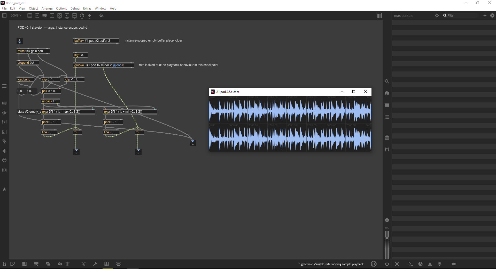

# Pod A graphics catalog

These SVGs are independently editable and use the same dark/amber/cyan layout as the Max prototype. Waveform previews show the empty state; the Max controller supplies real peaks after loading audio.

| Element | SVG | Max component |
| --- | --- | --- |
| Full layout | [pod-a-preview.svg](pod-a-preview.svg) | Seven instances combined |
| Header | [header.svg](header.svg) | `header` |
| Waveform and loop editor | [waveform.svg](waveform.svg) | `waveform` |
| Random / Jung slider | [jung-slider.svg](jung-slider.svg) | `jung` |
| Jitter slider | [jitter-slider.svg](jitter-slider.svg) | `jitter` |
| Slice stepper | [slice-stepper.svg](slice-stepper.svg) | `stepper slice` |
| Speed stepper | [speed-stepper.svg](speed-stepper.svg) | `stepper speed` |
| Mode buttons | [mode-buttons.svg](mode-buttons.svg) | `modes` |
| Loop handle | [loop-handle.svg](loop-handle.svg) | Drawn inside `waveform` |
| Mute / Solo | [mute-solo.svg](mute-solo.svg) | Drawn inside `header` |

M/S and loop handles are separate vector assets for reuse. Interactive loop handles stay inside the waveform canvas so pointer routing and loop bounds have one owner.

## Original repository picture references

The original pictures are retained in their existing locations. They were found by reference but could not be visually inspected through the current connection.

Original design image linked at the top of the repository README:

Existing Max 9 runtime screenshot:

Related sources:
- [Pod A approved UI contract](../../../design/POD_A_UI-R&D.md)
- [Existing mgraphics sketch](../../../design/v8ui_mgraphics_ui.js)
- [Browser concept prototype](../../showcase-v4/)
- [Design framework](../../../design/fl%C3%B6de-design-framework.md)

The new SVGs are a coded reconstruction from those written/source references, not extracted pixel layers from the PNG or attachment image. Review the pictures against the running Max preview before approving a final visual match.
