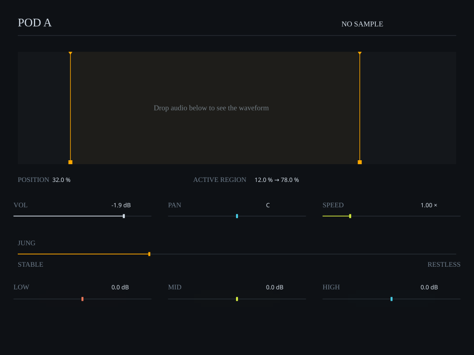

# UI LAB 001 SVG elements

These editable SVGs are renderer exports in the default, empty-waveform state.

| Element | Asset |
| --- | --- |
| Whole panel | [pod-a-lab-preview.svg](pod-a-lab-preview.svg) |
| POD A / sample header | [header.svg](header.svg) |
| Waveform / active region / playhead surface | [waveform.svg](waveform.svg) |
| Volume | [vol.svg](vol.svg) |
| Pan | [pan.svg](pan.svg) |
| Speed | [speed.svg](speed.svg) |
| JUNG stable/restless control | [jung.svg](jung.svg) |
| EQ Low | [eq_low.svg](eq_low.svg) |
| EQ Mid | [eq_mid.svg](eq_mid.svg) |
| EQ High | [eq_high.svg](eq_high.svg) |

The host renderer draws the playhead after real audio peaks have loaded. These empty-state snapshots do not contain invented waveform or playback data.

The subtle EQ fade is represented by editable translucent rectangles. SVG retains text, lines, rectangles and polygons; there are no external fonts, scripts or raster embeds. Runtime/native font appearance still needs review.

The same source renderer/controller runs in [Max 9 and p5.js](../README.md). The original reference pictures remain pending in the [reference register](../../../design/ui/component-atlas/references/README.md).
