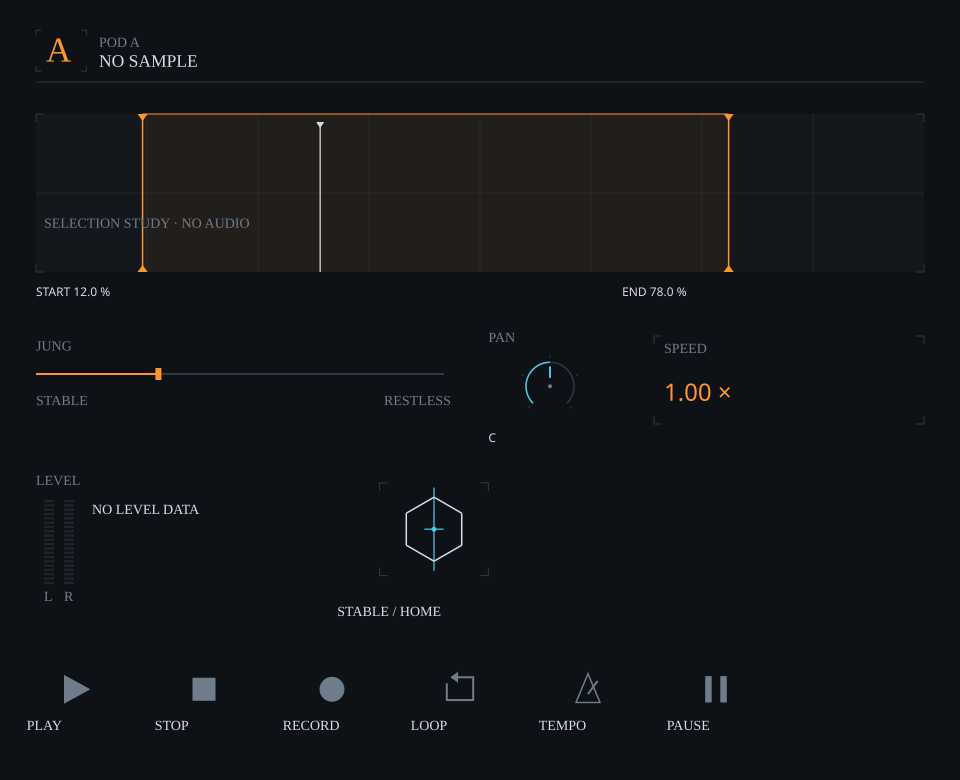

# flöde~ reference elements

Eight reusable families derived from [eight fully inspected pictures and one partial console screenshot](../../design/ui/component-atlas/references/ANALYSIS.md): pod address, selection geometry, fader, compact knob, numeric readout, stereo meter, JUNG glyph and named symbols. Isolated UI research on `max-msp`; no audio, transport or JUNG engine implementation.



**CJ's font choice:** Jersey 10 for labels/POD letters, IBM Plex Mono for numbers. Both fonts and their SIL Open Font Licences are [bundled](../../design/ui/component-atlas/fonts/). Browser previews load local fonts before drawing; exported SVGs embed only the fonts they use, keeping editable text and vector geometry.

## Try it

**Max 9:** install both bundled TTF fonts in your operating system, restart Max, then open [flode_reference_elements.maxproj](flode_reference_elements.maxproj) and its patch. Presentation shows thirteen instances of the eight families. JUNG drags horizontally, PAN vertically; Shift gives fine adjustment and double-click requests reset. The demo controller confirms parameter state. Symbol clicks only log requests. Range, meter and glyph are read-only displays. Patching view has manual glyph-state and explicit example-meter messages.

**p5.js:** serve the repository root:

```sh
python3 -m http.server 8000 --bind 127.0.0.1
```

Open http://127.0.0.1:8000/prototype/ui-reference-elements/p5/. Keyboard ranges and named symbol buttons accompany the canvas. Glyph state changes and example levels are manual; no independent animation or musical clock runs.

**Real audio:** use [UI LAB 001](../ui-lab-001/) for cached sample waveforms and interactive loop selection. Its labels/readouts now use the same fonts. This library's range graphic is explicitly an empty selection diagram.

## Reuse one element

The [single source](code/flode_reference_ui.js) works directly in Max `v8ui`, as browser global `FlodeReferenceUI`, and through CommonJS `require`. No Max objects are needed for its JavaScript drawing API.

```text
v8ui flode_reference_ui.js @arguments A fader jung
v8ui flode_reference_ui.js @arguments A knob pan
v8ui flode_reference_ui.js @arguments A meter meter
v8ui flode_reference_ui.js @arguments A glyph glyph
v8ui flode_reference_ui.js @arguments A icon loop
```

```js
const s = FlodeReferenceUI.scene("fader", {
  id: "jung", width: 440, height: 84, value: 0.3
});
FlodeReferenceUI.renderP5(s, p);           // p5 instance
FlodeReferenceUI.renderMgraphics(s, g);   // Max mgraphics
const svg = FlodeReferenceUI.toSvg(s);    // SVG string; fonts can be embedded via third argument
```

`scene(kind, options)` returns plain rect/line/poly/circle/text commands. It reads supplied state and never advances time. `renderP5` and `renderMgraphics` interpret the same commands; `toSvg` preserves editable primitives. [gallery.json](gallery.json) records the demonstrated bounds/options.

Recommended review sizes: pod 920 × 64; range 920 × 210; fader 440 × 84; knob 140 × 124; readout 302 × 104; meter 280 × 156; glyph 220 × 176; icon 112 × 84. Actual geometry comes from the host rectangle. These are study sizes, not production layout requirements.

## State and gestures

Max setters are silent:

```text
set value_norm 0.5 10
set display C 10 0.5
set loop 0.12 0.78
set playhead 0.32
set start_display 12.0 %
set end_display 78.0 %
set levels 0.68 0.57
set available 0
set clip 1
set active 1
set behavior_state intervention
set phase 0.75
enable 0
```

Continuous controls emit `pod A control_begin|change|commit <id> <0..1>` and `control_reset_request <id>`. Pressing never jumps a value. Relative movement, Shift sensitivity and temporary preview ownership are shared through `createControl`. Ordered controller revisions reject stale echoes; a preview display changes only when an echoed value matches it. A disabled control cancels its preview.

Icons emit `pod A action_request <symbol>`; they never toggle confirmed activity themselves. Meter silence and unavailable data are different states. Clip is shown only when explicitly supplied with available data. Range is read-only in this library.

JUNG state geometry is deterministic and bounded. Its cyan anchor stays fixed; RETURN HOME exactly reuses HOME edges. RESOLVING uses externally supplied `phase`, not a timer. It exposes no probabilities or seed editor.

## Assets and checks

[Individual SVG catalog](graphics/README.md): twenty-six editable assets, including six independent symbols and five JUNG state variants. Original reference pictures are preserved.

```sh
node prototype/ui-reference-elements/tests/elements.test.cjs
node prototype/ui-reference-elements/scripts/export-svg.cjs
node prototype/ui-lab-001/tests/lab.test.cjs
node prototype/ui-lab-001/scripts/export-svg.cjs
```

Thirteen element checks and ten POD A lab checks passed in a JavaScript isolate, with host calls recorded. The checks cover geometry parity, font choice/embedding, no-jump gestures, controller authority, canonical JUNG return and native patch wiring. The committed exporters produce 36 SVG assets across the library and POD A lab; SVG geometry and identifiers were checked.

No real Max or browser runtime was available. Opening, font appearance, resizing, pointer behavior and actual audio loading need a host check. Jersey 10 is a display face; labels have a 14-unit minimum in these studies, while numeric text uses IBM Plex Mono at 12 or larger.

The ninth reference, FLÖDE_ALL_PODS_VIEW.png, is present. CJ’s browser screenshot permits a partial upper-layout review; the original pixels and lower layout remain uninspected. Seven new static SVGs show A–F addresses individually and together. The interactive gallery remains POD A. This prototype does not advance the Alpha engine milestones.

[Reference-to-component map and direct reuse examples](SOURCE_MAP.md). The first component prototype is delivered; actual-host checks and further visual refinement remain open.
